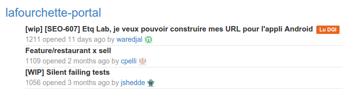

Provides an interface enumerating all Pull Requests.



Your team review PRs and tag them. If a PR got >= 2 tags, then it is displayed on a green background.

## With docker
```bash
# Building the docker image
sudo docker build -t delta2.lafourchette.lan:5000/pulltracker:v0.0.1 .

# Running it
sudo docker run -v /home/david/projects/pulltracker/config/default.json:/src/config/default.json -p 3000:3000 delta2.lafourchette.lan:5000/pulltracker:v0.0.1
```
